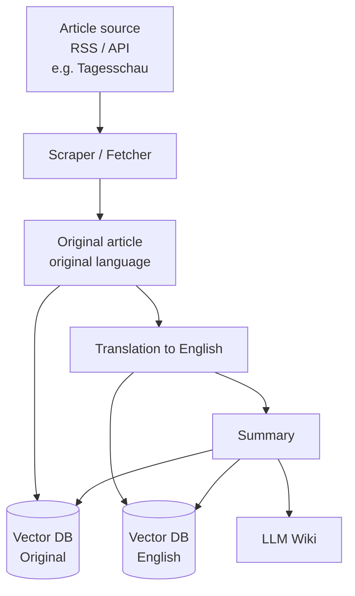

# News Context Pipeline

A system that automatically ingests news articles, translates them, summarizes them, and enriches them with additional context — accessible through a RAG knowledge base and an LLM wiki.

## About the project

News often comes without background knowledge, historical context, or framing — and usually only in one language. This project builds a pipeline that:

- automatically fetches articles from news sites (currently **Tagesschau**, more sources planned),
- stores the original articles in their original language in a vector database (RAG),
- translates the articles into English and stores the translation in the vector database as well,
- automatically generates summaries,
- makes these summaries available both in the RAG system and in an LLM-powered wiki.

The goal is a growing, searchable knowledge archive of news articles with multilingual access and added context.

## Architecture / Pipeline



**Step by step:**

1. **Fetching** – Articles are pulled via RSS feed or API from the respective news site.
2. **Store original** – The original text is written to the vector database in its source language.
3. **Translation** – The article is translated into English.
4. **Store translation** – The English version is also written to the vector database.
5. **Summarization** – A summary is generated from the article (original or translation).
6. **Knowledge storage** – The summary lands in both the RAG system and the LLM wiki, where it can be used for queries and further context.

## Roadmap

- [x] Prototype for one source (Tagesschau)
- [ ] Support for additional news sources
- [ ] Configurable target language for translation
- [ ] Automated scheduling / cron jobs for full pipeline runs
- [ ] Context enrichment (e.g. related articles, historical background)
- [ ] Web UI for the LLM wiki

## Tech stack

> TODO: fill in / adjust once concrete tools are decided.

| Area | Technology |
|---|---|
| Scraping / Fetching | e.g. Python + `feedparser` / `requests` |
| Translation | e.g. DeepL API / OpenAI / local model |
| Vector database | e.g. Qdrant / Weaviate / Chroma |
| Summarization | e.g. LLM API |
| Wiki / Frontend | TBD |

## Installation

```bash
git clone <repo-url>
cd <repo-name>
# install dependencies
pip install -r requirements.txt
```

## Usage

```bash
# Example: run the pipeline for one source
python main.py --source tagesschau
```

> TODO: document concrete CLI options / config file once defined.

## Project structure

```
.
├── fetcher/        # RSS/API connection to news sites
├── translator/     # translation logic
├── summarizer/      # summarization logic
├── vectorstore/     # vector database integration
├── wiki/            # LLM wiki integration
└── README.md
```

## Contributors

A project by three developers — built collaboratively.

## License

> TODO: decide on a license (e.g. MIT).
